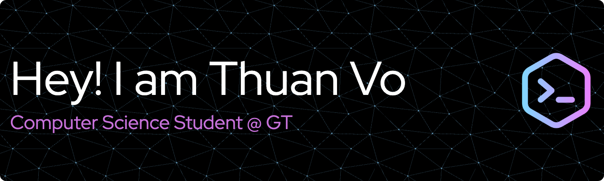

## 👨‍💻 Technology

## 😀 A little about me

🐝 I'm a junior at Georgia Tech.

🌱 I’m currently learning Computer Science (Info/Internetworks-Media)

🔭 I’m currently making automation protocol on Opentron OT-2.

## 📫 How to reach me:

- linkedin.com/in/thuanvo09
- thuanvo09@hotmail.com

## 🤩 Hobbies

Explore my photographs on 

## 👋 Fun

<!--
**thuanvoit/thuanvoit** is a ✨ _special_ ✨ repository because its `README.md` (this file) appears on your GitHub profile.

Here are some ideas to get you started:

- 🔭 I’m currently working on ...
- 🌱 I’m currently learning ...
- 👯 I’m looking to collaborate on ...
- 🤔 I’m looking for help with ...
- 💬 Ask me about ...
- 📫 How to reach me: ...
- 😄 Pronouns: ...
- ⚡ Fun fact: ...
-->
